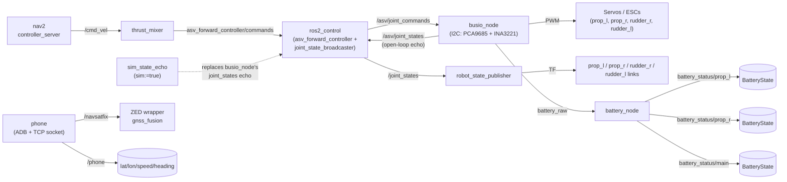
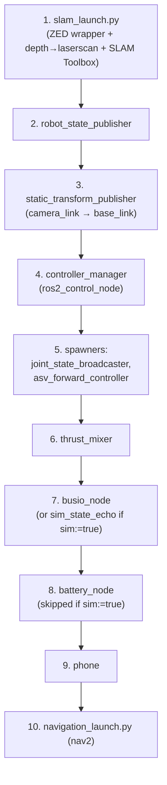

# loone

`loone` is [Humber ASV](https://humberasv.ca/)'s `ament_python` colcon package for
the Loon-E boat: the nav2 + `ros2_control` "chained controls" stack that turns
navigation goals into propeller/rudder PWM, plus the phone GPS bridge and
battery telemetry. See the [repo root README](../../README.md) for build/setup
instructions common to the whole workspace.

## Architecture

The boat is driven by nav2 through a stock `ros2_control`
`ForwardCommandController`, with a small Python "mixer" node translating
velocity commands into normalized servo fractions, and a single node
(`busio_node`) that is the only thing allowed to touch the I2C bus:



- **`thrust_mixer`** mixes nav2's `/cmd_vel` (surge + yaw) into four
  normalized `[prop_l, prop_r, rudder_r, rudder_l]` fractions (0.0-1.0, neutral
  ~0.5/0.55). The boat is a twin-float catamaran with one rudder per float, so
  the single computed rudder value is mirrored to both.
- **`busio_node`** is the only node that opens the I2C bus. It converts those
  fractions into PCA9685 pulse widths, and also reads the INA3221 and
  publishes raw bus voltages on `battery_raw`.
- **`battery_node`** subscribes to `battery_raw` and turns it into proper
  `sensor_msgs/BatteryState` messages per battery (percentage + health).
- **`sim_state_echo`** stands in for `busio_node`'s `/asv/joint_states` echo
  when running in simulation (`sim:=true`), since there is no real I2C bus to
  read there; `battery_node` is simply not started in sim (nothing publishes
  `battery_raw` without `busio_node`).
- **`phone`** is independent of the control chain: it pulls GPS/speed/heading
  from an Android phone over ADB + a TCP socket and publishes `/phone` and
  `/navsatfix` (the latter feeds the ZED wrapper's `gnss_fusion`).

### Bringup sequence

`launch/bringup.launch.py` starts everything above in a fixed order:



The old `task`/`motor`/`path_planning` nodes are intentionally **not** started
by `bringup.launch.py`; goals come from RViz "2D Goal Pose" or a
`NavigateToPose` action client.

## Nodes (`loone/loone/`)

| File | Executable | Status | Purpose |
|------|-----------|--------|---------|
| `phone.py` | `phone` | Current | ADB/TCP bridge: phone GPS, speed, heading → `/phone`, `/navsatfix` |
| `thrust_mixer.py` | `thrust_mixer` | Current | Mixes nav2 `/cmd_vel` into `[prop_l, prop_r, rudder_r, rudder_l]` fractions |
| `busio_node.py` | `busio_node` | Current | Only node touching I2C: writes PCA9685 PWM, reads INA3221 raw voltages |
| `battery_node.py` | `battery_node` | Current | Converts raw INA3221 voltages into `sensor_msgs/BatteryState` |
| `sim_state_echo.py` | `sim_state_echo` | Current (sim only) | Stands in for `busio_node`'s open-loop state echo in simulation |
| `task.py` | `task` | Legacy stub | Publishes a hardcoded test command on `task`; not part of the current nav2 chain |
| `task_logic_Njord.py` | *(not registered)* | Deprecated | Older, larger mission state machine superseded by `task.py`/nav2; kept for reference only |

> **Removed:** `motor.py` (the old direct-PID motor controller), `mapping.py`
> (GPS/vision occupancy-grid mapper), and `path_planning.py` (A\*-like path
> planner) have been deleted — their responsibilities now live in
> `busio_node`/`battery_node`, nav2, and SLAM Toolbox respectively.
> `setup.py`'s `console_scripts` still lists `motor`, `mapping`, and
> `path_planning` entry points pointing at these deleted modules; those three
> entries are currently dangling and will fail if run.

## Launch files (`launch/`)

| File | Status | Purpose |
|------|--------|---------|
| `bringup.launch.py` | Current | Full nav2 + `ros2_control` stack (see diagrams above) |
| `slam_launch.py` | Current | ZED wrapper + depth→laserscan + SLAM Toolbox (included by `bringup.launch.py`) |
| `rviz_launch.py` | Current | Opens RViz2 pre-configured for the bringup stack |
| `launch.py` | Legacy | Starts `phone` + `task` + `motor` — the `motor` executable is broken now that `motor.py` is gone |

## Configuration (`config/`)

- `ros2_control.yaml` — `controller_manager`, `asv_forward_controller`, `joint_state_broadcaster`.
- `nav2_params.yaml` — nav2 stack params (no AMCL/map_server; SLAM Toolbox owns the map).
- `mapper_params_online_async.yaml` — SLAM Toolbox params.
- `depth_to_laserscan.yaml` — `depthimage_to_laserscan` params.
- `model.yaml` — ZED custom object detection class map (buoy colors + `otter`).
- `config.yaml` — legacy per-node parameters (`/task`, `/phone`, `/path`, `/led`, `/mapping`, `/motor`);
  see [wiki/setup/CONFIG.md](../../wiki/setup/CONFIG.md) for the full parameter reference.

## Testing

```bash
python3 -m pytest src/loone/test/test_phone.py src/loone/test/test_busio_node.py \
    src/loone/test/test_battery_node.py src/loone/test/test_thrust_mixer.py -v
```

Every test mocks hardware access (I2C / `busio` / `board` / PCA9685 / INA3221)
and ROS I/O, so nothing needs real hardware or a running ROS graph beyond the
session-scoped `rclpy.init()` context set up in `test/conftest.py`. If
`board`/`busio` aren't installed (e.g. off-Jetson), add `test/stubs` to
`PYTHONPATH` first — this is exactly what CI does (see
`.github/workflows/tests.yml`):

```bash
export PYTHONPATH="$PYTHONPATH:$(pwd)/src/loone:$(pwd)/src/loone/test/stubs"
```
